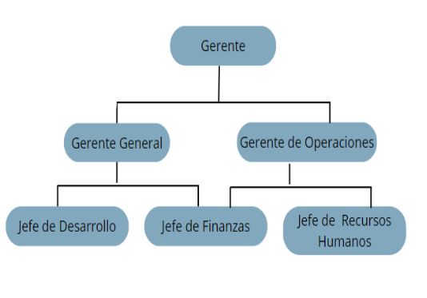



**UNIVERSIDAD PRIVADA DE TACNA**

**FACULTAD DE INGENIERIA**

**Escuela Profesional de Ingeniería de Sistemas**

` `**Proyecto *LastShot - Plataforma de Juegos Sociales Interactivos***

Curso: *Patrones de Software*

Docente: Mag. Patrick Cuadros Quiroga

Integrantes:

***SEBASTIAN NICOLAS FUENTES AVALOS		(2022073902)***

***MAYRA FERNANDA CHIRE RAMOS			(2021072620)***

***GABRIELA LUZKALID GUTIERREZ MAMANI 	(2022074263)***

**Tacna – Perú**

***2025***
**\

|CONTROL DE VERSIONES||||||
| :-: | :- | :- | :- | :- | :- |
|Versión|Hecha por|Revisada por|Aprobada por|Fecha|Motivo|
|1\.0|SFA|GGM|MCR|27/09/2025|Versión Original|
|2\.0|SFA|GGM|MCR|30/10/2025|Versión Original|

**Sistema *LastShot - Plataforma de Juegos Sociales Interactivos***

**Documento de Especificación de Requerimientos de Software**

**Versión *2.0***
**\

|CONTROL DE VERSIONES||||||
| :-: | :- | :- | :- | :- | :- |
|Versión|Hecha por|Revisada por|Aprobada por|Fecha|Motivo|
|1\.0|SFA|GGM|MCR|27/09/2025|Versión Original|
|2\.0|SFA|GGM|MCR|30/10/2025|Versión Original|

**INDICE GENERAL**
#
[INTRODUCCIÓN	4](#_toc212821236)

[I. Generalidades de la Empresa	4](#_toc212821237)

[1. Nombre de la Empresa	4](#_toc212821238)

[2. Vision	4](#_toc212821239)

[3. Mision	4](#_toc212821240)

[4. Organigrama	5](#_toc212821241)

[II. Visionamiento de la Empresa	5](#_toc212821242)

[1. Descripción del Problema	5](#_toc212821243)

[2. Objetivos de Negocios	5](#_toc212821244)

[3. Objetivos de Diseño	5](#_toc212821245)

[4. Alcance del proyecto	6](#_toc212821246)

[5. Viabilidad del Sistema	6](#_toc212821247)

[6. Información obtenida del Levantamiento de Informacion	6](#_toc212821248)

[III.  Análisis de Procesos	7](#_toc212821249)

[a) Diagrama del Proceso Actual – Diagrama de actividades	7](#_toc212821250)

[b) Diagrama del Proceso Propuesto – Diagrama de actividades Inicial	7](#_toc212821251)

[IV Especificacion de Requerimientos de Software	8](#_toc212821252)

[a) Cuadro de Requerimientos funcionales Inicial	8](#_toc212821253)

[b) Cuadro de Requerimientos No funcionales	8](#_toc212821254)

[c) Cuadro de Requerimientos funcionales Final	9](#_toc212821255)

[d) Reglas de Negocio	10](#_toc212821256)

[V Fase de Desarrollo	10](#_toc212821257)

[1. Perfiles de Usuario	10](#_toc212821258)

[2. Modelo Conceptual	11](#_toc212821259)

[a) Diagrama de Paquetes	11](#_toc212821260)

[b) Diagrama de Casos de Uso	11](#_toc212821261)

[c) Escenarios de Caso de Uso (narrativa)	11](#_toc212821262)

[3. Modelo Logico	16](#_toc212821263)

[a)	Diagrama de objetos	16](#_toc212821264)

[b) Diagrama de Actividades con objetos	18](#_toc212821265)

[c) Diagrama de Secuencia	20](#_toc212821266)

[d) Diagrama de Clases	22](#_toc212821267)

[CONCLUSIONES	22](#_toc212821268)

[RECOMENDACIONES	22](#_toc212821269)

[BIBLIOGRAFÍA	23](#_toc212821270)

[WEBGRAFÍA	23](#_toc212821271)

# [**INTRODUCCIÓN**](#_heading=h.y5jf20tiz1ev)
El presente proyecto tiene como propósito desarrollar una aplicación móvil interactiva denominada LastShot, orientada a ofrecer experiencias de juegos multijugador en tiempo real. El sistema está basado en una arquitectura cliente-servidor, donde la comunicación entre los usuarios y el backend se realiza mediante el protocolo WebSocket, permitiendo la transmisión continua de información sin interrupciones y garantizando una interacción fluida durante las partidas.

La aplicación integra una interfaz móvil intuitiva desarrollada con tecnologías modernas y un servidor backend desplegado en la nube a través de Azure App Service, utilizando una pila Node.js para la lógica del servidor y la gestión de eventos. Además, se incorporan servicios de Firebase, como Authentication y Firestore, para asegurar un manejo confiable de las cuentas de usuario, almacenamiento de datos y sincronización de perfiles en línea.

El desarrollo de este sistema busca poner en práctica conceptos fundamentales de la ingeniería de software, tales como el diseño modular, la comunicación en tiempo real, la integración de servicios externos y la seguridad en aplicaciones distribuidas. Asimismo, se enfatiza el uso de herramientas de modelado como PlantUML para representar visualmente los procesos del sistema mediante diagramas de clases, actividades y secuencia, lo que facilita la comprensión de la lógica interna y las interacciones entre los componentes.

En conjunto, este proyecto constituye un ejemplo de cómo la combinación de tecnologías actuales —como Firebase, WebSocket, Azure y Node.js— puede emplearse para construir soluciones escalables, seguras y orientadas a la colaboración entre múltiples usuarios. El resultado final es una aplicación capaz de gestionar perfiles, crear y unir salas de juego, sincronizar eventos en tiempo real y ofrecer una experiencia digital moderna y dinámicas.
# [**I. Generalidades de la Empresa**	](#_heading=h.l35cjpfq0moy)
## `	`**[**1. Nombre de la Empresa**](#_heading=h.7lj19pswwxxu)**
`	     `CAPICODEX
## `	`**[**2. Vision**](#_heading=h.7lj19pswwxxu)**
En CAPICODEX, aspiramos a ser líderes en el desarrollo de soluciones tecnológicas que impulsen el crecimiento regional a través de la innovación digital. Con proyectos como GameOn Network y el Dashboard de Accidentes Tacna, buscamos transformar la gestión de información en distintos sectores, promoviendo la eficiencia, la transparencia y el acceso equitativo a los datos. Nuestra visión es fortalecer el ecosistema tecnológico de la región, conectando a ciudadanos, instituciones y autoridades en un entorno digital moderno y colaborativo.

## `	`**[**3. Mision**](#_heading=h.7lj19pswwxxu)**
Nuestra misión en CAPICODEX es desarrollar plataformas digitales que optimicen la gestión y el acceso a la información pública, facilitando la toma de decisiones basada en datos. Nos comprometemos a ofrecer herramientas tecnológicas innovadoras, seguras y accesibles que promuevan la participación ciudadana, la prevención de riesgos y el desarrollo sostenible de la ciudad de Tacna.

## `	`**[**4. Organigrama**](#_heading=h.7lj19pswwxxu)**

# [**II. Visionamiento de la Empresa**	](#_heading=h.l35cjpfq0moy)
## `	`**[**1. Descripción del Problema**](#_heading=h.7lj19pswwxxu)**
Actualmente, el entretenimiento social en reuniones y eventos presenta las siguientes limitaciones:

- **Dependencia de materiales físicos**: los juegos tradicionales requieren cartas, dados, tableros y otros elementos que deben comprarse, transportarse y prepararse.
- **Tiempo de preparación**: las actividades recreativas exigen planificación previa y setup, restando espontaneidad a las reuniones.
- **Limitaciones de participantes**: muchos juegos físicos están diseñados para cantidades específicas de jugadores, excluyendo a algunos asistentes.
- **Falta de variedad**: adquirir múltiples juegos físicos implica costos elevados y espacio de almacenamiento.
- **Desigualdad en la participación**: en reuniones sin estructura lúdica, algunos asistentes tienden a quedar al margen de las conversaciones.
- **Aplicaciones existentes inadecuadas**: la mayoría de apps de juegos se enfocan en entretenimiento individual o competencias online con desconocidos, perdiendo el aspecto social presencial.

Esto impide contar con una solución digital accesible, versátil y orientada específicamente al fortalecimiento de vínculos interpersonales en contextos presenciales, limitando la calidad de la experiencia social en eventos y reuniones.
## `	`**[**2. Objetivos de Negocios**](#_heading=h.7lj19pswwxxu)**
El proyecto busca sentar una base sólida para la monetización futura mediante compras in-app y funciones premium, alcanzar 10,000 descargas en los primeros seis meses, mantener un promedio de tres partidas por sesión de usuario, lograr que el 60% de los usuarios inviten amigos mediante códigos QR y posicionarse como la aplicación número uno de juegos de mesa digitales en Perú.
## `	`**[**3. Objetivos de Diseño**](#_heading=h.7lj19pswwxxu)**
La aplicación presenta una interfaz intuitiva que no requiere tutorial, proporcionando una experiencia de juego fluida y entretenida. Está optimizada para pantallas táctiles y uso con una mano, cuenta con una arquitectura escalable que soporta crecimiento exponencial y funciona tanto en modo online (multijugador) como offline (solo device).
## `	`**[**4. Alcance del proyecto**](#_heading=h.7lj19pswwxxu)**
El alcance del proyecto abarca el desarrollo y despliegue de una aplicación móvil multiplataforma construida en Flutter, diseñada para ofrecer juegos sociales interactivos con comunicación en tiempo real.

**Incluye lo siguiente:**

- Desarrollo de aplicación móvil para Android e iOS utilizando Flutter 3.0+.
- Implementación de sistema de autenticación de usuarios mediante Firebase Authentication.
- Desarrollo de backend en tiempo real con Node.js y Socket.IO para sincronización de juegos multijugador.
- Creación de interfaz de usuario intuitiva y atractiva con soporte para hasta 8 jugadores simultáneos.
- Sistema de salas de juego con códigos de acceso y gestión de sesiones.
- Integración de múltiples juegos sociales interactivos con mecánicas variadas.
- Despliegue en Google Play Store para dispositivos Android.

Con este alcance, el proyecto se enfoca en proporcionar una herramienta de entretenimiento social que facilite la integración grupal en eventos presenciales mediante tecnología móvil moderna.
## `	`**[**5. Viabilidad del Sistema**](#_heading=h.7lj19pswwxxu)**
El sistema es técnicamente sólido, utilizando un stack probado basado en Flutter, Node.js y Firebase. Económicamente, presenta costos iniciales bajos y escalado según demanda. Temporalmente, el desarrollo se completó en cuatro meses con un equipo de tres personas. Operacionalmente, requiere un mantenimiento mínimo gracias a los servicios cloud, y legalmente cumple con GDPR y posee términos de servicio claros. 
## `	`**[**6. Información obtenida del Levantamiento de Informacion**](#_heading=h.7lj19pswwxxu)**
El público objetivo son jóvenes de 18 a 35 años, estudiantes universitarios y grupos de amigos. La información se obtuvo mediante encuestas a 200 personas, entrevistas a 15 usuarios y análisis de la competencia. El 85% conoce VASTA y el 70% juega juegos de mesa digitales. El 95% utiliza Android y el 60% se coordina mediante WhatsApp. Se identificaron oportunidades como la falta de aplicaciones locales, la demanda de juegos peruanos y la popularidad de los códigos QR post-pandemia. Entre los riesgos se encuentran la competencia internacional, la dependencia de conectividad y la curva de adopción inicial.
# [**III.  Análisis de Procesos**	](#_heading=h.l35cjpfq0moy)
## `	`**[**a) Diagrama del Proceso Actual – Diagrama de actividades**](#_heading=h.7lj19pswwxxu)**

## `	`**[**b) Diagrama del Proceso Propuesto – Diagrama de actividades Inicial**](#_heading=h.7lj19pswwxxu)**

# [**IV Especificacion de Requerimientos de Software**	](#_heading=h.l35cjpfq0moy)
1) ## [**Cuadro de Requerimientos funcionales Inicial**](#_heading=h.7lj19pswwxxu)

|**ID**|**Nombre**|**Descripción**|**Prioridad**|
| - | - | - | - |
|**RF01**|**Administrar Perfil de Usuario**|El sistema debe permitir a los usuarios administrar su perfil (registro, login, edición de datos personales, logout)|**ALTA**|
|**RF02**|**Explorar Juegos Multijugador**|El sistema debe permitir explorar y acceder a juegos multijugador (VASTA, El Infiltrado del Bar) con funcionalidades de sala compartida|**ALTA**|
|**RF03**|**Juegos de Dispositivo Único**|El sistema debe proporcionar juegos de dispositivo único (TODITO, YO NUNCA) que funcionen offline con animaciones|**MEDIA**|
|**RF04**|**Administrar Salas de Juego**|El sistema debe permitir administrar salas de juego (crear, configurar, invitar, gestionar participantes)|**ALTA**|
|**RF05**|**Comunicación en Tiempo Real**|El sistema debe implementar comunicación en tiempo real mediante WebSockets para sincronización de estados|**ALTA**|
|**RF06**|**Generación de Códigos QR**|El sistema debe generar códigos QR para facilitar el acceso y compartir la aplicación|**MEDIA**|
|**RF07**|**Manejo de Desconexiones**|El sistema debe manejar desconexiones automáticamente y permitir reconexión sin pérdida de progreso|**ALTA**|

1) ## [**Cuadro de Requerimientos No funcionales**](#_heading=h.7lj19pswwxxu)

|**ID**|**Nombre**|**Descripción**|**Prioridad**|
| - | - | - | - |
|**RNF01**|**Rendimiento**|Tiempo de respuesta < 200ms para acciones locales y < 500ms para sincronización de red|**ALTA**|
|**RNF02**|**Usabilidad**|Interfaz intuitiva con jerga peruana familiar y iconos universalmente reconocibles|**ALTA**|
|**RNF03**|**Compatibilidad**|Compatible con Android 6.0+ (API 23+) e iOS 10.0+, soporte para WiFi y datos móviles|**ALTA**|
|**RNF04**|**Confiabilidad**|Disponibilidad del 99.5%, recuperación automática ante fallos, manejo robusto de errores|**ALTA**|
|**RNF05**|**Seguridad**|Encriptación HTTPS/WSS, validación de entrada, autenticación JWT, cumplimiento GDPR|**ALTA**|
|**RNF06**|**Mantenibilidad**|Código modular, documentación completa, logging detallado, arquitectura escalable|**MEDIA**|
|**RNF07**|**Portabilidad**|Flutter multiplataforma, backend Node.js independiente, Firebase cloud, despliegue multi-cloud|**MEDIA**|

## [**c) Cuadro de Requerimientos funcionales Final**](#_heading=h.7lj19pswwxxu)

|**ID**|**Nombre**|**Descripción**|**Prioridad**|
| - | - | - | - |
|**RF01**|**Administrar Perfil de Usuario**|El sistema debe permitir a los usuarios administrar su perfil (registro, login, edición de datos personales, logout)|**ALTA**|
|**RF02**|**Explorar Juegos Multijugador**|El sistema debe permitir explorar y acceder a juegos multijugador (VASTA, El Infiltrado del Bar) con funcionalidades de sala compartida|**ALTA**|
|**RF03**|**Juegos de Dispositivo Único**|El sistema debe proporcionar juegos de dispositivo único (TODITO, YO NUNCA) que funcionen offline con animaciones|**MEDIA**|
|**RF04**|**Administrar Salas de Juego**|El sistema debe permitir administrar salas de juego (crear, configurar, invitar, gestionar participantes)|**ALTA**|
|**RF05**|**Comunicación en Tiempo Real**|El sistema debe implementar comunicación en tiempo real mediante WebSockets para sincronización de estados|**ALTA**|
|**RF06**|**Generación de Códigos QR**|El sistema debe generar códigos QR para facilitar el acceso y compartir la aplicación|**MEDIA**|
|**RF07**|**Manejo de Desconexiones**|El sistema debe manejar desconexiones automáticamente y permitir reconexión sin pérdida de progreso|**ALTA**|

## `	`**[**d) Reglas de Negocio**](#_heading=h.7lj19pswwxxu)**
`	`Las principales reglas de negocio establecidas fueron las siguientes:

- RN-01: Todo usuario debe autenticarse con usuario y contraseña válidos para acceder al sistema.
- RN-02: Los registros de requerimientos o métricas no pueden eliminarse de forma definitiva, únicamente se podrán marcar como inactivos.
- RN-03: Todos los requerimientos funcionales deben clasificarse en prioridad Alta, Media o Baja.
- RN-04: Solo los administradores tienen permiso para gestionar usuarios y modificar configuraciones generales del sistema.
# [**V Fase de Desarrollo**	](#_heading=h.l35cjpfq0moy)
## `	`**[**1. Perfiles de Usuario**](#_heading=h.7lj19pswwxxu)**
Se definieron los siguientes perfiles de usuario para la fase de desarrollo del sistema:

- Usuario anfitrión (creador de sala): crea sesiones de juego, genera códigos de acceso, selecciona juegos, gestiona participantes y controla el flujo de las dinámicas.
- Usuario jugador: se une a salas mediante códigos, participa en los juegos, interactúa con otros jugadores y disfruta de la experiencia social.
- Usuario casual: busca entretenimiento rápido sin configuraciones complejas, priorizando simplicidad e inmediatez.
## `	`**[**2. Modelo Conceptual**	](#_heading=h.7lj19pswwxxu)**

### `	`***[***a) Diagrama de Paquetes***](#_heading=h.7lj19pswwxxu)***

### `	`***[***b) Diagrama de Casos de Uso***](#_heading=h.7lj19pswwxxu)***

### `	`***[***c) Escenarios de Caso de Uso (narrativa)***](#_heading=h.7lj19pswwxxu)***
#### `	     `***RF-001 Administrar Perfil de Usuario***

|**Administrar Perfil de Usuario**||
| - | :- |
|**Tipo**|**Obligatorio**|
|**Autor(es)**|**Gabriela Luzkalid Gutierrez Mamani**|
|**Actores**|**Usuario jugador**|
|**Descripción**|**La aplicación móvil permite al Usuario iniciar sesión, cerrar sesión, registrarse en la aplicación y modificar su nombre de Usuario y contraseña.**|
|**Precondiciones**|**El usuario jugador debe tener descargada la aplicación y conexión a internet.**|
|`                                                      `**Narrativa de cada de uso**||
|`                   `**Acción del actor**|`                   `**Respuesta del sistema**|
|1. El usuario abre la aplicación LastShot|2. El sistema muestra la pantalla principal con opciones de login/registro|
|3. El usuario selecciona "Registrarse" e ingresa email y contraseña|4. El sistema valida los datos ingresados|
||5. El backend envía la información a Firebase Authentication|
||6. Firebase confirma la creación de la cuenta|
||7. El sistema almacena el perfil básico en Firestore|
||8. El sistema genera un token JWT para la sesión|
||9. El sistema muestra mensaje de "Registro exitoso" y redirige al lobby principal|
|10. El usuario puede editar su perfil (nombre, avatar, configuraciones)|11. El sistema actualiza los cambios en Firestore y confirma la actualización|

#### ***RF02 – Explorar juegos Multijugador***

|**Explorar juegos Multijugador**||
| - | :- |
|**Tipo**|**Obligatorio**|
|**Autor(es)**|**Mayra Fernanda Chire Ramos**|
|**Actores**|**Usuario Jugador**|
|**Descripción**|**La aplicación móvil muestra un listado de juegos de la aplicación que funcionan de manera multijugador, por lo general el jugador crea una sala en la aplicación móvil y la aplicación genera un código de ingreso que el jugador anfitrión tendrá que compartir con sus amigos para que puedan ingresar a la sala de juego.**|
|**Precondiciones**|**Iniciado sesión en la aplicación.**|
|`                                                      `**Narrativa de cada de uso**||
|`                   `**Acción del actor**|`                   `**Respuesta del sistema**|
|1. El usuario autenticado accede a la sección "Juegos Multijugador"|2. El sistema muestra la lista de juegos disponibles (VASTA, El Infiltrado del Bar)|
|3. El usuario selecciona un juego específico (ej: VASTA)|4. El sistema muestra opciones: "Crear Sala" o "Unirse a Sala"|
|5. El usuario elige "Unirse a Sala" e ingresa un código de sala|6. El sistema valida el código con el backend vía WebSocket|
||7. El backend verifica que la sala existe y tiene espacio disponible|
||8. El sistema añade al usuario a la sala y sincroniza con otros jugadores|
||9. El sistema muestra la pantalla de lobby con jugadores conectados|
||10. El sistema actualiza en tiempo real cuando otros jugadores se unen/salen|
|11. El usuario espera a que el organizador inicie la partida|12. El sistema recibe señal de inicio y carga la pantalla del juego|

#### ***RF03 – Explorar Juegos de Dispositivo Único***

|**Explorar Juegos de Dispositivo Único**||
| - | :- |
|**Tipo**|**Obligatorio**|
|**Autor(es)**|**Sebastián Nicolas Fuentes Avalos**|
|**Actores**|**Usuario Jugador**|
|**Descripción**|**La aplicación móvil muestra el listado de juegos de SOLO DEVICE, es decir, juegos diseñados para que un grupo de personas jueguen desde un solo dispositivo móvil.**|
|**Precondiciones**|**Iniciado sesión en la aplicación.**|
|`                                                      `**Narrativa de cada de uso**||
|`                   `**Acción del actor**|`                   `**Respuesta del sistema**|
|1. El usuario accede a la sección "Juegos Solo Device"|2. El sistema muestra la lista de juegos offline (TODITO, YO NUNCA)|
|3. El usuario selecciona un juego (Ejm: YO NUNCA)|4. El sistema carga el juego desde memoria local (sin conexión de red)|
||5. El sistema inicializa el mazo de 100 cartas predefinidas|
||6. El sistema muestra la primera carta con animación|
|7. El usuario toca la pantalla para ver la siguiente carta|8. El sistema reproduce animación de transición|
||9. El sistema muestra la nueva carta aleatoria del mazo|
||10. El sistema actualiza el contador de cartas mostradas|
|11. El usuario puede reiniciar el juego o cambiar de juego|12. El sistema reinicia el mazo y vuelve al estado inicial|
####

#### ***RF04 – Administrar Sala de Juego***

|**Administrar Sala de Juego**||
| - | :- |
|**Tipo**|**Obligatorio**|
|**Autor(es)**|**Sebastián Nicolas Fuentes Avalos**|
|**Actores**|**Usuario Jugador**|
|**Descripción**|**La aplicación móvil, cuando el usuario jugador selecciona un juego Multijugador, tiene la opción de compartir el código de acceso de la sala de juego y eliminar jugadores de la sala.**|
|**Precondiciones**|**Explorar Juegos Multijugador**|
|`                                                      `**Narrativa de cada de uso**||
|`                   `**Acción del actor**|`                   `**Respuesta del sistema**|
|1. El usuario selecciona "Crear Sala" desde un juego multijugado|2. El sistema solicita al backend crear una nueva sala|
||3. El backend genera un código único de 6 dígitos para la sala|
||4. El backend crea la instancia de sala en memoria con el usuario como organizador|
||5. El sistema muestra el código de sala y genera QR code automáticamente|
||6. El sistema establece conexión WebSocket para tiempo real|
|7. El usuario configura parámetros del juego (tiempo por turno, número de rondas)|8. El sistema sincroniza la configuración con todos los dispositivos conectados|
|9. El usuario comparte el código QR o código numérico con otros jugadores|10. El sistema actualiza la lista de jugadores conforme se van uniendo|
|11. El usuario inicia la partida cuando tiene suficientes jugadores|12. El backend valida que hay mínimo de jugadores requeridos|
||13. El sistema envía señal de inicio a todos los dispositivos conectados|
||14. El sistema carga la pantalla de juego para todos los participantes simultáneamente|

## [**   	](#_heading=h.l35cjpfq0moy)
1) ### ***Diagrama de objetos***

#### ***Diagrama de objetos del CUS - Administrar Perfil de Usuario***

#### ***Diagrama de objetos del CUS -  Explorar Juegos Multijugador***

#### ***Diagrama de objetos del CUS -  Explorar Juegos de Dispositivo Único***

#### ***Diagrama de objetos del CUS - Administrar Sala de Juego***

### `	`***b[***) Diagrama de Actividades con objetos***](#_heading=h.7lj19pswwxxu)***

#### `	     `***Diagrama de Actividades con objetos del CUS - Administrar Perfil de Usuario***

#### ***Diagrama de Actividades con objetos del CUS - Explorar Juegos Multijugador***

#### ***Diagrama de Actividades con objetos del CUS - Explorar Juegos de Dispositivo Único***

####
#### ***Diagrama de Actividades con objetos del CUS - Administrar Sala de Juego***

### 	***c[***) Diagrama de Secuencia***](#_heading=h.7lj19pswwxxu)***

#### `	`***     D[***iagrama de Secuencia***](#_heading=h.7lj19pswwxxu) del CUS - Administrar Perfil de Usuario***

#### ***D[***iagrama de Secuencia***](#_heading=h.7lj19pswwxxu) del CUS - Explorar Juegos Multijugador***

#### ***D[***iagrama de Secuencia***](#_heading=h.7lj19pswwxxu) del CUS - Explorar Juegos de Dispositivo Único***

#### ***D[***iagrama de Secuencia***](#_heading=h.7lj19pswwxxu) del CUS - Administrar Sala de Juego***

### `	`***d[***) Diagrama de Clases***](#_heading=h.7lj19pswwxxu)***

# [**CONCLUSIONES**](#_heading=h.zhgktmo5hklg)
- El desarrollo del sistema permitió comprender e implementar de forma efectiva una arquitectura cliente-servidor moderna, donde la aplicación móvil, el backend y el gestor de WebSocket trabajan de manera coordinada para ofrecer una experiencia multijugador fluida en tiempo real.
- La integración de WebSocket resultó esencial para mantener una comunicación bidireccional constante entre los usuarios y el servidor, permitiendo sincronización instantánea de eventos como la creación de salas, uniones de jugadores y el inicio de partidas.
- La correcta división de responsabilidades entre los módulos —Aplicación Móvil, Servidor Backend y WebSocket Manager— facilitó la escalabilidad y mantenimiento del sistema, alineándose con buenas prácticas de diseño de software y principios de ingeniería orientada a componentes.
- El uso de herramientas de desarrollo actuales (como frameworks móviles, servicios en la nube y control de versiones con GitHub) permitió construir un entorno de trabajo colaborativo, seguro y fácilmente desplegable en distintos escenarios de prueba.
- Este proyecto representa una base sólida para futuros desarrollos en el ámbito de juegos en línea y aplicaciones interactivas, evidenciando la importancia de la comunicación en tiempo real y la optimización de la experiencia del usuario.

# [**RECOMENDACIONES**](#_heading=h.uzi8oymm2pix)
- Implementar un sistema de autenticación de usuarios (por ejemplo, mediante tokens JWT) para reforzar la seguridad y personalización de las sesiones de juego.
- Incorporar métricas de rendimiento y monitoreo (logs de conexión, tiempo de respuesta, número de jugadores activos) que permitan optimizar los recursos del servidor en escenarios de alta concurrencia.
- Evaluar la migración hacia una infraestructura con balanceo de carga y escalado automático, especialmente si el número de jugadores concurrentes crece significativamente.
- Documentar todas las API del backend mediante herramientas como Swagger o Postman, facilitando la comprensión y mantenimiento del sistema por parte de futuros desarrolladores.
- Considerar la integración de notificaciones push o alertas en tiempo real para mejorar la interacción entre los jugadores y aumentar la retención de usuarios en la aplicación.
- Realizar pruebas exhaustivas de seguridad y estrés (por ejemplo, simulación de múltiples conexiones WebSocket simultáneas) antes de un despliegue en producción.

# [**BIBLIOGRAFÍA**](#_heading=h.1kaoe2cubbyl)
# Sommerville, I. (2016). Ingeniería del Software (10ª edición). Pearson Educación.
# Pressman, R. S., & Maxim, B. R. (2019). Software Engineering: A Practitioner’s Approach. McGraw-Hill Education.
# Fowler, M. (2003). Patterns of Enterprise Application Architecture. Addison-Wesley.
# Bass, L., Clements, P., & Kazman, R. (2021). Software Architecture in Practice (4th Edition). Addison-Wesley Professional.
Tanenbaum, A. S., & Wetherall, D. J. (2011). Redes de Computadoras. Pearson Educación.
# [**WEBGRAFÍA**](#_heading=h.mkmfgmvy7hbw)
MDN Web Docs. (2024). Introducción a WebSocket.

https://developer.mozilla.org/es/docs/Web/API/WebSockets\_API

PlantUML Documentation. (2024). Activity Diagrams Syntax.

https://plantuml.com/activity-diagram

Azure App Service Documentation. (2024). Deploying Node.js and PHP apps.

https://learn.microsoft.com/azure/app-service/

Firebase Documentation. (2024). Realtime Database y Cloud Firestore.

https://firebase.google.com/docs

Socket.IO Official Docs. (2024). Real-time communication for web and mobile apps.

https://socket.io/docs/

GitHub Docs. (2024). Continuous Deployment with GitHub Actions.

https://docs.github.com/
